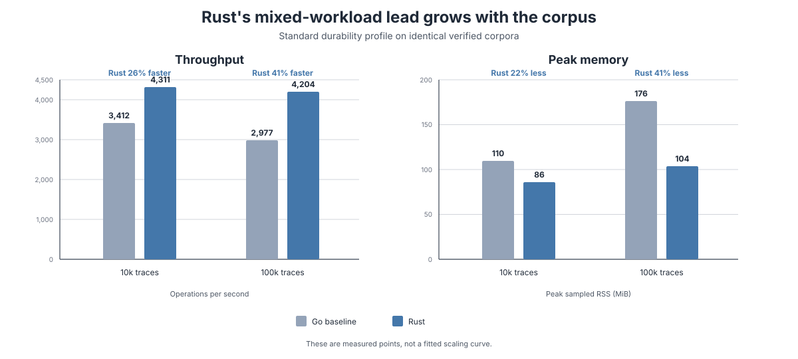
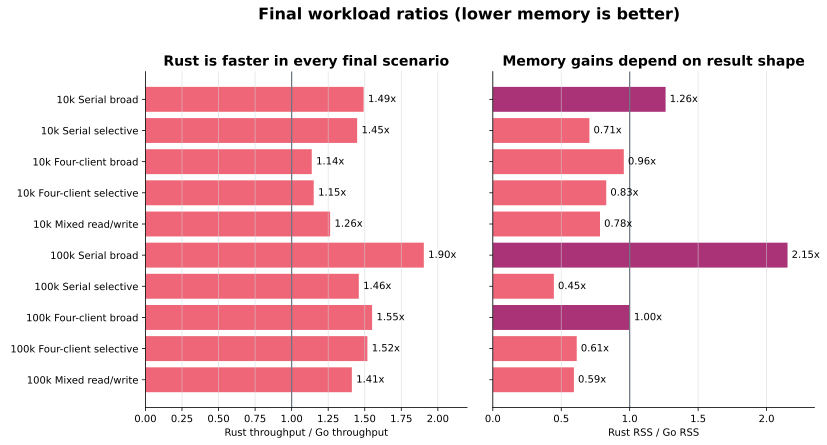
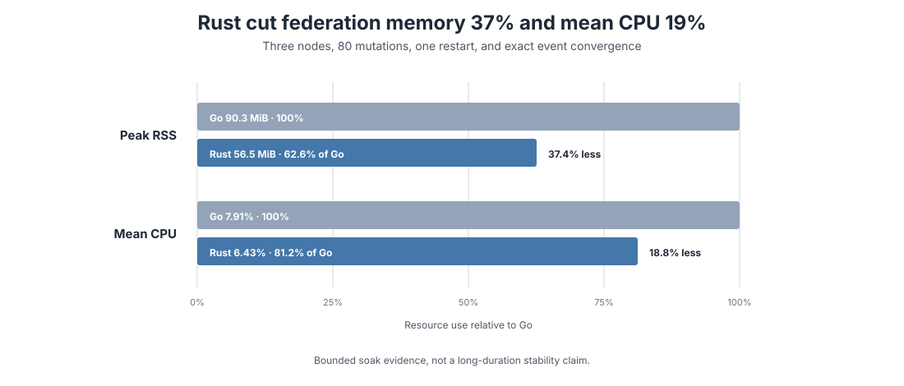
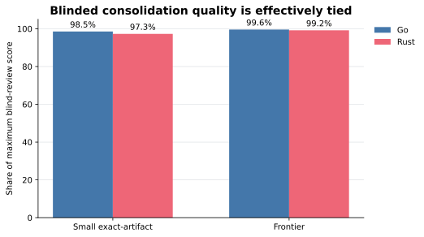
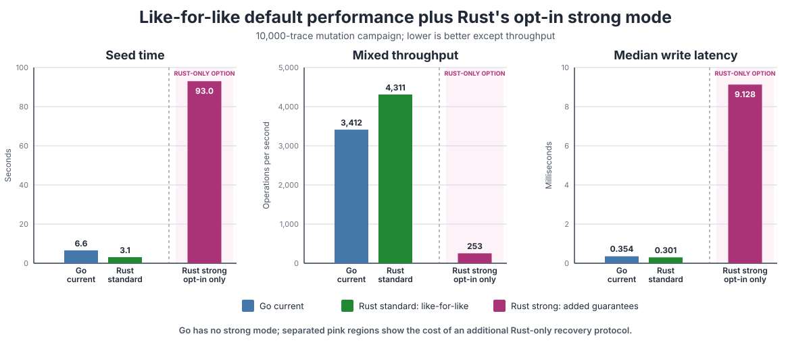
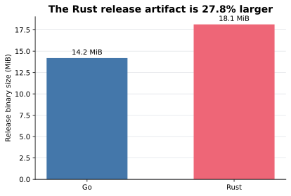

# Why switch Noema to Rust?

Status: living rewrite assessment, last updated 2026-08-17.

Noema's Rust implementation is now a credible replacement candidate for the Go
implementation. The case is not that Rust is universally faster, nor that a
language rewrite automatically improves a system. The case is that this
specific implementation now matches Noema's tested behavior, improves the
workloads most representative of a long-lived memory service, and makes an
enhanced recovery protocol available without imposing its cost on every user.

The current recommendation is to finish the remaining release qualification
and stage a controlled migration to Rust. Go should remain the behavioral
oracle and rollback path until that rollout is complete.

> **★ Insight**
>
> The decision changed when the comparison stopped treating durability policy
> as implementation performance. Under the default `standard` profile, Rust
> and Go perform equivalent mutation work. Under `strong`, Rust deliberately
> performs more work to buy a stronger recovery guarantee.

## Decision scorecard

| Dimension | Current result | Interpretation |
| --- | --- | --- |
| Public behavior | Differential suites pass across storage, CLI, MCP, federation, consolidation, watcher, plugins, restore, semantic search, and TUI state | No known public command or protocol port remains |
| Mixed throughput | Rust is 26.3% faster at 10k traces and 41.2% faster at 100k | Favors Rust |
| Mixed-workload memory | Rust uses 21.7% less RSS at 10k and 40.8% less at 100k | Favors Rust |
| Selective retrieval | Rust is faster and uses less RSS at both final scales | Favors Rust |
| Full-corpus output | Rust is faster, but one 100k process retains 2.15 times Go's RSS | Important Rust caveat |
| Federation soak | Rust uses 37.4% less peak aggregate RSS and 18.8% less mean sampled CPU | Favors Rust in the bounded test |
| Consolidation quality | Exact-artifact and frontier blind reviews are effectively tied | Parity, not a language advantage |
| Default durability | `standard` matches Go's mutation and crash posture | Migration does not impose an immediate performance regression |
| Enhanced durability | `strong` passes process-death and APFS detach/remount recovery, with a large write cost | Useful opt-in; hard power-cut/device-cache qualification remains |
| Release artifact | Rust is 27.8% larger in the current local release build | Favors Go, but operational impact is small |
| Release readiness | Packaging, rollback, real-power-loss behavior, older-Go takeover, and broader human/model validation remain | Candidate, not unconditional replacement |

## Performance at scale

The final scale campaign used release-optimized binaries, five
alternating-order runs, fresh MCP server processes per scenario, four clients,
exact post-write trace counts, and `verify` after mutation. The 100k campaign
used independent byte-identical clones of one verified 100,150-trace corpus.



| Mixed workload | Go throughput | Rust throughput | Go RSS | Rust RSS |
| --- | ---: | ---: | ---: | ---: |
| 10k traces | 3,412.50 ops/s | 4,311.13 ops/s | 109.6 MiB | 85.8 MiB |
| 100k traces | 2,977.24 ops/s | 4,203.50 ops/s | 175.6 MiB | 104.0 MiB |

The mixed workload matters because Noema is not only a search index. A running
server serves selective reads while agents create and update traces. Rust's
advantage grows rather than disappears between the two measured corpus sizes.
These are two measured points, not a fitted scaling curve.

### The workload shape matters

Rust led every final throughput median. Memory was more nuanced: selective and
mixed workloads favored Rust, four-client broad output was nearly tied at
100k, and single-process broad output favored Go substantially.



| Scale and scenario | Throughput vs. Go | Peak memory vs. Go |
| --- | ---: | ---: |
| 10k serial broad | 49% faster | 26% more |
| 10k serial selective | 45% faster | 29% less |
| 10k four-client broad | 14% faster | 4% less |
| 10k four-client selective | 15% faster | 17% less |
| 10k mixed read/write | 26% faster | 22% less |
| 100k serial broad | 90% faster | 115% more |
| 100k serial selective | 46% faster | 55% less |
| 100k four-client broad | 55% faster | approximately equal |
| 100k four-client selective | 52% faster | 39% less |
| 100k mixed read/write | 41% faster | 41% less |

The 100k serial-broad result is the clearest remaining performance target. It
does not erase the gains elsewhere, but it prevents a claim that Rust always
uses less memory. Full-corpus MCP responses should eventually become bounded or
streamed regardless of implementation.

## Long-lived federation uses fewer resources

A bounded homogeneous three-node soak applied 80 paced mutations over eight
seconds, restarted one node, verified exact event convergence, and measured the
three-server aggregate. Both implementations converged to exactly 80 unique
events per node.



| Three-server aggregate | Go | Rust | Rust/Go |
| --- | ---: | ---: | ---: |
| Wall time | 9.586 s | 9.112 s | 0.950x |
| Peak sampled RSS | 90.266 MiB | 56.469 MiB | 0.626x |
| Mean sampled CPU | 7.913% | 6.429% | 0.812x |

This is a short resource comparison, not a stability claim. It nevertheless
shows that Rust's memory advantage survives active replication, restart, and
convergence rather than appearing only in a single-process microbenchmark.

## Model-driven quality reached bounded parity

The hardest qualitative comparison originally favored Go. That was useful: it
exposed abbreviated Rust prompts, weaker output-shape validation, source-ID
leakage, and an insufficient polysemy rule. Porting the complete prompt
contracts and applying the same grounding changes to both implementations
closed those defects.



| Qualification | Go | Rust | Shared correctness result |
| --- | ---: | ---: | --- |
| Small exact-artifact blind review | 473/480 | 467/480 | 48/48 decisions and 203/204 adjudicated retention each |
| Frontier blind review | 239/240 | 238/240 | 24/24 decisions and 102/102 retention each |
| Large profile | Not blind-scored | Not blind-scored | 24/24 decisions and 102/102 retention each |

In the exact-artifact batch, 36 of 48 pairs tied. The preceding independent
batch narrowly favored Rust, while the final batch narrowly favored Go. With
equal prompts, symmetric factual error, and equal decision accuracy, the
defensible conclusion is bounded quality parity rather than a winner.

Rust retained a process-memory advantage during model-driven work. The final
small-profile median peak RSS was 14.820 MiB versus Go's 23.508 MiB. Model wall
time was effectively tied and should not be presented as client-runtime speed.

> **★ Insight**
>
> The failed early quality comparison strengthened the port. It demonstrated
> that the gap came from incomplete behavioral translation, not from Rust, and
> it left both runtimes with stricter prompts and validation.

## Durability is an explicit product choice

The canonical profiles are:

- `standard` — the default. It matches Go's direct trace-file write and single
  SQLite transaction, without a per-mutation recovery journal or file/directory
  fsync.
- `strong` — opt-in recovery records, stable mutation locks, atomic temporary
  files, rename, file and directory fsync, and recovery reconciliation.

`compatible` remains accepted as a legacy alias for `standard`, but runtime
introspection reports the canonical name.



| Runtime and profile | Seed time | Mixed throughput | Median write latency | Durability posture |
| --- | ---: | ---: | ---: | --- |
| Go current | 6.596 s | 3,412.50 ops/s | 0.354 ms | Current/default posture |
| Rust standard | 3.096 s | 4,311.13 ops/s | 0.301 ms | Matches Go's posture |
| Rust strong | 92.987 s | 252.75 ops/s | 9.128 ms | Adds journaled recovery and explicit flushes |

A second ordinary Go control was recorded during the Rust-strong campaign
(6.491 seconds seed, 3,299.16 mixed ops/s, and 0.348 ms median write latency).
It confirms that the Go baseline was stable; it is not a Go strong profile and
is therefore not plotted as one.

Strong mode is not a fair drop-in performance comparison with Go because it
performs a different durability protocol. Its cost is still operationally
important: users selecting it should understand the write amplification. The
strong subprocess suite validates process-death recovery. A separate macOS
APFS gate forcibly detaches and remounts disposable images at restore,
configuration, and mutation boundaries; four complete runs preserved explicit
restore recovery, cleared the strong journal, and retained SQLite integrity.
Forced detach may still honor completed flushes, so this does not prove
behavior when hardware loses an already-acknowledged volatile write cache.

The stronger protocol is also not an intrinsic Rust feature. It could be
implemented in Go. Rust made the protocol practical to express and test within
this rewrite, while the profile boundary lets Noema ship it without redefining
the default behavior.

## Artifact size and operational shape



| Release artifact | Bytes | MiB |
| --- | ---: | ---: |
| Go | 14,887,442 | 14.2 |
| Rust | 19,019,360 | 18.1 |

The Rust artifact is currently 27.8% larger. Both remain single local binaries,
so the practical distribution cost is modest, but this is a real Go advantage.
Rust also changes the build and cross-compilation toolchain; bundled SQLite and
platform packaging need release-matrix validation rather than assumptions from
the Go pipeline.

Rust's language-level contribution is compile-time memory and thread safety for
a server that combines SQLite access, background federation, watchers,
consolidation, TLS, and concurrent MCP transports. That is a maintainability
and defect-prevention argument, not a measured performance percentage.

## Why the final results differ from the first results

The experiment found and corrected several implementation effects:

1. The first Rust MCP server reopened the cortex for every request. Retaining
   one connection removed that avoidable overhead.
2. Rust initially emitted pretty full-row MCP results where Go emitted compact
   rows. Matching the wire representation removed response and allocation bias.
3. New Rust traces used an update-style FTS delete before insert. Because the
   stored `id` column was not the FTS rowid, each delete scanned an increasingly
   large virtual table. Insert-only create helpers removed the corpus-size
   regression.
4. Strong durability initially looked like a general Rust mutation problem.
   Separating it from the standard profile showed that most of the difference
   was extra recovery work, not a language-runtime limit.

Only the corrected final campaigns are used in the headline scale charts.
Earlier results remain valuable as an optimization history, not as final
Go-versus-Rust evidence.

## What remains before replacement

The port should not become the unconditional release binary until the remaining
qualification and rollout decisions are closed:

1. Repeat the passing macOS APFS forced-detach qualification on a hard-powered
   VM or disposable hardware target. The local gate covers restore placement,
   configuration rename, journal cleanup, SQLite recovery, and acknowledged
   standard-mode state, but cannot force a device to lose already-acknowledged
   cache writes.
2. Decide whether corrupt-database salvage belongs in Noema; Rust currently
   fails closed and preserves the bytes.
3. Define takeover behavior for older Go binaries that do not understand Rust
   pending-mutation records.
4. Complete human TUI checks across the supported terminal emulators.
5. Extend qualitative evaluation to a redacted representative corpus,
   additional models, and multiple reviewers.
6. Define packaging, binary naming, staged migration, telemetry, rollback, and
   the period during which the Go binary remains available.
7. Repeat the release qualification and key performance campaign against the
   exact candidate commit.

## Reproduction and maintenance

The curated chart data lives in
[`tests/rust-rewrite/report-data.json`](../tests/rust-rewrite/report-data.json).
Regenerate every SVG after updating it:

```sh
make rust-report
```

The selected `REPORT_PYTHON` interpreter needs Matplotlib. It remains a report
tooling dependency, not a Noema runtime dependency. Override the interpreter
when necessary, for example `make rust-report REPORT_PYTHON=/path/to/python`.
Set `NOEMA_REPORT_PREVIEW_DIR=/tmp/noema-report-preview` to render uncommitted
PNG copies for visual review alongside the canonical SVGs.

When adding a new result:

1. Require its correctness gate to pass first.
2. Use release-optimized binaries and record the candidate commit and host.
3. Preserve alternating order, independent corpora, fresh processes, run count,
   and exact post-write verification.
4. Update the curated JSON, regenerate the charts, and update this document's
   date and adjacent accessible tables.
5. Mark superseded measurements as historical rather than silently combining
   incompatible campaigns.
6. Run `make rust-test`, `make compare-rust`, and `git diff --check` before
   treating the report as release evidence.

Detailed methodology and historical results remain in the
[`Rust rewrite experiment results`](rust-rewrite-experiment-results.md), the
current qualification state in [`Rust rewrite status`](rust-rewrite-status.md),
and acceptance criteria in the
[`Rust rewrite test plan`](rust-rewrite-test-plan.md).
